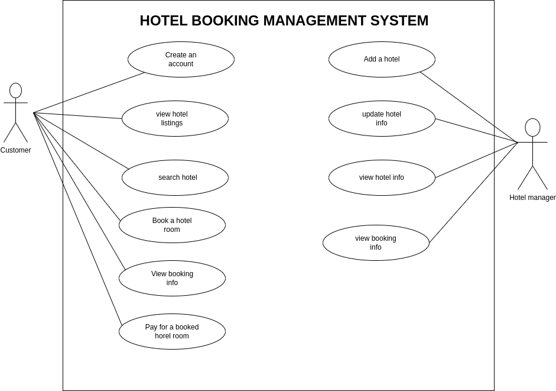

# Requirement Analysis in Software Development.

This purpose of this project is to understand the Requirement Analysis phase of the Software Development Life cycle (SDLC). To understand how to structure, analyze, and document system requirements. To undestand how to utilize use case diagrams to show how actors interact with the system to achieve specifi goals.

## What is Requirement Analysis?

Requirement Analysis is the process of gathering, defining, analzying and prioritizing the requirements of the proposed system. It's a crucial stage in the Software Development Life Cycle as it helps developer teams to identify key features and functionalities expected to be in the system and also define the scope (boundaries) of the system.

## Why is Requirement Analysis Important?

Requirement Analysis is important for the following reasons:

- **Identification of requirements:** helps developers to understand what functionalities are expected by the stakeholders, to be in the system.
- **Define scope:** helps developers understand what to include in the system and what not to, clearly defining the boundaries of the system.
- **Basis for design and development:** provides a solid foundation for the design and development phases that come later in the SDLC.
- **Facilitates Communication:** between the developers and stakeholders ensuring that both parties clearly understand what is expected.

## Key Activities in Requirement Analysis

The following list shows the key activities in the Requirement Analysis process:

- **Requirement Gathering:** the goal of this activity is to collect initial system requirements from stakeholders. Techniques used include _interviews_, _use of questionnaires_, _surveys_ etc.

- **Requirement Elicitation:** the goal of this activity is to refine and elaborate on the gathered requirements, ensuring they are clear, comprehensive, and actionable. Teams typically conduct brainstorming sessions or workshops to analyze , and enhance the requirements.

- **Requirement Documentation** in this activity, a requirements specification document is created to clearly define the identified system requirements. This document also includes the acceptance criteria for each requirement, ensuring a clear understanding of how success will be measured.

- **Requirement Analysis and Modeling** in this activity, the team usually categories and prioritizes requirements in order of their importance and need, also models and entity-relation diagrams are created to visualize and understand the requirements.

- **Requirement Validation**: the goal of this activity is to review and validate the system requirements to ensure that they align with the stakeholder's needs and interests.

## Types of Requirements

There are two types of system requirements.

### Functional Requiremnts

Functional requirments describe what the system should do.
Some functional requirements for a hotel booking management system include:

- **Hotel listing:** the system should display the available hotels
- **Searching:** the system should allow users to search for hotel rooms based on given criteria.
- **Booking:** the system should allow registered users to book a hotel of their interest.
- **View booking info:** the system should allow users to view booking information once they book a hotel room.
- **Payment**:the system should allow users to pay for the duration that they to stay at a given hotel.

### Non-functional Requiremnts

Non-functional requirements describe how the system should perform.
Some non-functional requirements for a hotel booking management system include:

- **Reliablity:** the system should be relaible and should allow more than 1 user to book the same hotel room.
- **Secure:** the system should provide secure gateways for payment transactions.
- **Performance** the system should process and handle user requests efficiently, with response times meeting or exceeding the specified performance benchmarks under typical and peak load conditions.

## Use Case Diagrams.

A use case diagram is a UML diagram that is used to show how users/actors interact with the system to achieve a given goal/use case.
Use case diagrams are used to visually represent functional requirements of a system

### use case diagram for a hotel booking system

## Acceptance Criteria

Acceptance criteria is a set of conditions that must be met for a feature to be accepted by the user.
Acceptance criteria is importanct as it help to ensure that both parties have a clear understanding of the feature requirement and provide a basis for testing and validation.
For example in the hotel management system described above an acceptance criteria (s) for a checkout feature could be as follows:

- The user should be able to view a detailed breakdown of the total price, including taxes and additional fees.
- The system should provide secure payment options to allow the user to complete the transaction.
- A confirmation message should be displayed upon successful payment, including a receipt or reference number.
- The system should handle errors gracefully, providing clear feedback if payment fails or is declined.
